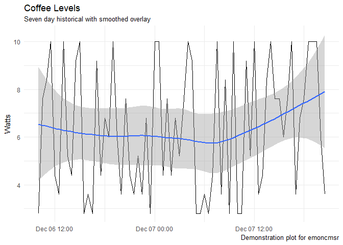

`emoncmsr`: R interface to the [emonCMS](https://github.com/emoncms/emoncms) API
--------------------------------------------------------------------------------

[](https://travis-ci.org/davidski/emoncmsr) [](https://ci.appveyor.com/project/davidski/emoncmsr) [](https://codecov.io/github/davidski/emoncmsr?branch=master)

This package provides the tools to create, delete, and manage inputs and feeds in the open source energy, temperature and environmental monitoring sytem from [OpenEnergyMonitor](https://openenergymonitor.org/).

emonCMS has two flavors, a self-hosted version and a hosted solution at [emoncms.org](https://emoncms.org). The two APIs are similar but differ in a number of areas. This package only supports the self-hosted flavor, though there are several unsupported functions for the hosted version.

This package takes a slightly opinionated view towards the API, returning normalized values from many of the API calls. The native API has several non- standard and inconsistent responses to both success and failure. `emoncmsr` provides an interface consistent with data analysis and a tidy pipeline.

Installation
------------

``` r
devtools::install_github("davidski/emoncmsr")
```

Usage
-----

emoncmsr requires two environment variables to locate the emoncms host and the proper API key for authentication. These can be set globally (e.g. via `.bashrc`, the Windows control panel, or other OS-specific mechanism) or you can place them in your `~.Renviron` file for a portable solution.

Environment variables used:

-   EMONCMS\_URI - Full URL (w/final slash) to API endpoint
-   EMONCMS\_API\_KEY - API key value (read or write) to API

Applications
------------

Simulating a beverage sensor that monitors the level of coffee, tea, and water available. First, we'll list the inputs currently configured.

``` r
library(emoncmsr)
suppressPackageStartupMessages(library(tidyverse))  # use the tidyverse

# Inputs
list_inputs()
```

    ## # A tibble: 28 x 7
    ##       id  nodeid   name                 description
    ##  * <chr>   <chr>  <chr>                       <chr>
    ##  1     0 emonth5   rssi                            
    ##  2     1 emontx1 power1               House Power 1
    ##  3     2 emontx1 power2               House Power 2
    ##  4     3 emontx1 power3 Office Branch Circuit Power
    ##  5     5 emontx1   vrms                            
    ##  6     6 emontx1  temp1               Basement Temp
    ##  7     7 emontx1  temp2                            
    ##  8     8 emontx1  temp3                            
    ##  9     9 emontx1  temp4                            
    ## 10    10 emontx1  temp5                            
    ## # ... with 18 more rows, and 3 more variables: processList <chr>,
    ## #   time <int>, value <dbl>

Now we'll create some simulated data, post it to emonCMS as inputs using a node identifier of `emoncmsr`, read back the value of the coffee level we just posted, store the ID of this new coffee input for future use, and set a useful description for the new input. Whew! Let's get to it!

``` r
# create some beverage data
dat <- list(coffee = 42, tea = 6, water = 42)
post_data_to_input(dat)
```

    ## [1] TRUE

``` r
list_inputs() %>% filter(nodeid == "emoncmsr", name == "coffee")
```

    ## # A tibble: 1 x 7
    ##      id   nodeid   name description processList       time value
    ##   <chr>    <chr>  <chr>       <chr>       <chr>      <int> <dbl>
    ## 1   163 emoncmsr coffee                         1512840812    42

``` r
# store the id of the new input
inputid <- list_inputs() %>% 
  filter(nodeid == "emoncmsr", name == "coffee") %>% 
  pull(id)
inputid
```

    ## [1] "163"

``` r
# set a friendly description for our new input
set_input_field(inputid, "description", "cups of coffee remaining in pot")
```

    ## # A tibble: 1 x 2
    ##   success       message
    ##     <lgl>         <chr>
    ## 1    TRUE Field updated

``` r
list_inputs() %>% filter(id == inputid)
```

    ## # A tibble: 1 x 7
    ##      id   nodeid   name                     description processList
    ##   <chr>    <chr>  <chr>                           <chr>       <chr>
    ## 1   163 emoncmsr coffee cups of coffee remaining in pot            
    ## # ... with 2 more variables: time <int>, value <dbl>

That wasn't so bad!

While we're now accepting levels of coffee, tea, and water in emonCMS, those values aren't being stored or processed in any way. We'd like to monitor the levels of coffee over time. We need to create a feed, then configure the coffee input to send its data to that feed.

``` r
# Create a feed for the coffee level
feed_response <- create_feed("coffeelevel", "emoncmsr")
feed_response
```

    ## # A tibble: 1 x 3
    ##   success feedid result
    ##     <lgl>  <int>  <lgl>
    ## 1    TRUE     89   TRUE

``` r
# Show that the feed exists
list_feeds() %>% filter(id == feed_response$feedid)
```

    ## # A tibble: 1 x 11
    ##      id userid        name datatype      tag public  size engine
    ##   <chr>  <chr>       <chr>    <chr>    <chr>  <chr> <chr>  <chr>
    ## 1    89      1 coffeelevel        1 emoncmsr            0      5
    ## # ... with 3 more variables: processList <chr>, value <dbl>, time <int>

``` r
# Hook up the coffee monitor to the feed
set_input_process(inputid, paste(1, feed_response$feedid, sep = ":"))
```

    ## # A tibble: 1 x 2
    ##   success                   message
    ##     <lgl>                     <chr>
    ## 1    TRUE Input processlist updated

``` r
get_input_processes(inputid)
```

    ## [1] "1:89"

Now that we have our feed set up, let's send some updated beverage level sensor data. We'll first send a single timepoint set of values, then demonstrate using the bulk data interface to several days of simulated data in a single call.

After sending the readings we'll read the feed metadata to demonstrate that data has flowed from the input to the feed.

``` r
# Post a single set of readings to all three new inputs
dat <- list(coffee = 86, tea = 100, water = 4)
post_data_to_input(dat)
```

    ## [1] TRUE

``` r
# show the values we just posted appeared in the inputs
list_inputs() %>% filter(nodeid == "emoncmsr")
```

    ## # A tibble: 3 x 7
    ##      id   nodeid   name                     description processList
    ##   <chr>    <chr>  <chr>                           <chr>       <chr>
    ## 1   163 emoncmsr coffee cups of coffee remaining in pot        1:89
    ## 2   164 emoncmsr    tea                                            
    ## 3   165 emoncmsr  water                                            
    ## # ... with 2 more variables: time <int>, value <dbl>

``` r
# We can also use the bulk data input format for sending a dataframe 
# worth of data, all at different offsets to an optional timestamp
interval <- get_feed_metadata(feed_response$feedid)$interval
end_time <- lubridate::now() %>% as.integer()
end_time <- end_time - (end_time %% interval)
start_time <- (lubridate::now() - lubridate::ddays(3)) %>% as.integer()
start_time <- start_time - (start_time %% interval)

times <- seq(start_time, end_time, by = interval)
dat <- tibble(offset = times, nodeid = "emoncmsr")
dat <- bind_cols(dat, tibble(value = map(times, ~list("coffee" = sample(1:10, size=1)))))
post_bulk_data_to_input(dat, reference_time = 0)
```

    ## [1] TRUE

``` r
# this large a bulk post can take a moment to process, sleep for a few seconds
Sys.sleep(5)

# we can also post with a specific reference time, though we don't demonstrate
# that here...
# reference_time <- lubridate::as_datetime("2017-03-27 01:30:00") %>% as.integer()
# post_bulk_data_to_input(dat, reference_time)


# show the feed's info
get_feed_metadata(feed_response$feedid)
```

    ## # A tibble: 1 x 4
    ##   feed_id interval start_time npoints
    ##     <int>    <int>      <int>   <int>
    ## 1      89       10 1512581610   25921

Beverage monitoring systems [are GO](https://en.wikipedia.org/wiki/Thunderbirds_Are_Go)! Let's pull a set of data from our feed and plot that data over time, adding a smoothed curve for grins.

``` r
dat <- get_feed_data(feed_response$feedid)
gg <- ggplot(dat, aes(x = date, y = value)) + 
  geom_line() + geom_smooth(method = 'loess') +
  labs(title = "Coffee Levels", 
       subtitle = "Seven day historical with smoothed overlay",
       caption = "Demonstration plot for emoncmsr",
       y = "Watts", 
       x = NULL) +
  scale_y_continuous(labels = scales::pretty_breaks()) +
  theme_minimal()
gg
```



Finally, clean up the test inputs and feeds we created.

``` r
list_feeds() %>% filter(tag == "emoncmsr") %>% pull(id) %>% 
  map(~ delete_feed(.x))
```

    ## [[1]]
    ## # A tibble: 1 x 1
    ##   success
    ##     <lgl>
    ## 1    TRUE

``` r
list_inputs() %>% filter(nodeid == "emoncmsr") %>% pull(id) %>% 
  map(~ delete_input(.x))
```

    ## [[1]]
    ## [1] TRUE
    ## 
    ## [[2]]
    ## [1] TRUE
    ## 
    ## [[3]]
    ## [1] TRUE

Test results
------------

``` r
library(emoncmsr)
library(testthat)
```

    ## 
    ## Attaching package: 'testthat'

    ## The following object is masked from 'package:dplyr':
    ## 
    ##     matches

    ## The following object is masked from 'package:purrr':
    ## 
    ##     is_null

``` r
date()
```

    ## [1] "Sat Dec 09 09:34:53 2017"

``` r
test_dir("tests/")
```

    ## testthat results ===========================================================
    ## OK: 0 SKIPPED: 0 FAILED: 0
    ## 
    ## DONE ======================================================================

Contributing
============

This project is governed by a [Code of Conduct](./CODE_OF_CONDUCT.md). By participating in this project you agree to abide by these terms.

License
=======

The [MIT License](LICENSE) applies.
