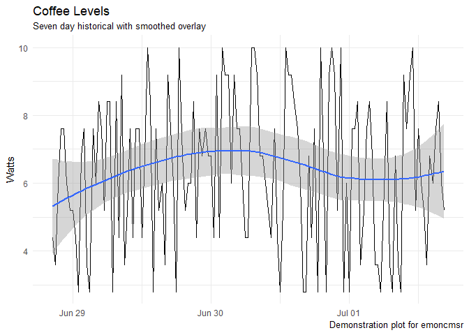

`emoncmsr`: R interface to the [emonCMS](https://github.com/emoncms/emoncms) API
--------------------------------------------------------------------------------

This package provides the tools to create, delete, and manage inputs and feeds in the open source energy, temperature and environmental monitoring sytem from [OpenEnergyMonitor](https://openenergymonitor.org/).

emonCMS has two flavors, a self-hosted version and a hosted solution at [emoncms.org](https://emoncms.org). The two APIs are similar but differ in a number of areas. This package only supports the self-hosted flavor, though there are several unsupported functions for the hosted version.

This package takes a slightly opinionated view towards the API, returning normalized values from many of the API calls. The native API has several non- standard and inconsistent responses to both success and failure. `emoncmsr` provides an interface consistent with data analysis and a tidy pipeline.

Installation
------------

``` r
devtools::install_github("davidski/emoncmsr")
```

Usage
-----

emoncmsr requires two environment variables to locate the emoncms host and the proper API key for authentication. These can be set globally (e.g. via `.bashrc`, the Windows control panel, or other OS-specific mechanism) or you can place them in your `~.Renviron` file for a portable solution.

Environment variables used:

-   EMONCMS\_URI - Full URL (w/final slash) to API endpoint
-   EMONCMS\_API\_KEY - API key value (read or write) to API

Applications
------------

Simulating a beverage sensor that monitors the level of coffee, tea, and water available. First, we'll list the inputs currently configured.

``` r
library(emoncmsr)
suppressPackageStartupMessages(library(tidyverse))  # use the tidyverse

# Inputs
list_inputs()
```

    ## # A tibble: 15 x 7
    ##       id  nodeid     name                      description
    ##  * <chr>   <chr>    <chr>                            <chr>
    ##  1     1 emontx1   power1                    House Power 1
    ##  2     2 emontx1   power2                    House Power 2
    ##  3     3 emontx1   power3      Office Branch Circuit Power
    ##  4     5 emontx1     vrms                                 
    ##  5     6 emontx1    temp1                    Basement Temp
    ##  6     7 emontx1    temp2                                 
    ##  7     8 emontx1    temp3                                 
    ##  8     9 emontx1    temp4                                 
    ##  9    10 emontx1    temp5                                 
    ## 10    11 emontx1    temp6                                 
    ## 11    12 emontx1    pulse                                 
    ## 12    13 emontx1     rssi                                 
    ## 13    14 emontx1   power4 Living Room Branch Circuit Power
    ## 14    15 weather     temp                                 
    ## 15    16 weather humidity                                 
    ## # ... with 3 more variables: processList <chr>, time <int>, value <dbl>

Now we'll create some simulated data, post it to emonCMS as inputs using a node identifier of `emoncmsr`, read back the value of the coffee level we just posted, store the ID of this new coffee input for future use, and set a useful description for the new input. Whew! Let's get to it!

``` r
# create some beverage data
dat <- list(coffee = 42, tea = 6, water = 42)
post_data_to_input(dat)
```

    ## [1] TRUE

``` r
list_inputs() %>% filter(nodeid == "emoncmsr", name == "coffee")
```

    ## # A tibble: 1 x 7
    ##      id   nodeid   name description processList       time value
    ##   <chr>    <chr>  <chr>       <chr>       <chr>      <int> <dbl>
    ## 1   116 emoncmsr coffee                         1498926098    42

``` r
# store the id of the new input
inputid <- list_inputs() %>% 
  filter(nodeid == "emoncmsr", name == "coffee") %>% 
  pull(id)
inputid
```

    ## [1] "116"

``` r
# set a friendly description for our new input
set_input_field(inputid, "description", "cups of coffee remaining in pot")
```

    ## # A tibble: 1 x 2
    ##   success       message
    ##     <lgl>         <chr>
    ## 1    TRUE Field updated

``` r
list_inputs() %>% filter(id == inputid)
```

    ## # A tibble: 1 x 7
    ##      id   nodeid   name                     description processList
    ##   <chr>    <chr>  <chr>                           <chr>       <chr>
    ## 1   116 emoncmsr coffee cups of coffee remaining in pot            
    ## # ... with 2 more variables: time <int>, value <dbl>

That wasn't so bad!

While we're now accepting levels of coffee, tea, and water in emonCMS, those values aren't being stored or processed in any way. We'd like to monitor the levels of coffee over time. We need to create a feed, then configure the coffee input to send its data to that feed.

``` r
# Create a feed for the coffee level
feed_response <- create_feed("coffeelevel", "emoncmsr")
feed_response
```

    ## # A tibble: 1 x 3
    ##   success feedid result
    ##     <lgl>  <int>  <lgl>
    ## 1    TRUE     67   TRUE

``` r
# Show that the feed exists
list_feeds() %>% filter(id == feed_response$feedid)
```

    ## # A tibble: 1 x 11
    ##      id userid        name datatype      tag public  size engine
    ##   <chr>  <chr>       <chr>    <chr>    <chr>  <chr> <chr>  <chr>
    ## 1    67      1 coffeelevel        1 emoncmsr            0      5
    ## # ... with 3 more variables: processList <chr>, time <int>, value <dbl>

``` r
# Hook up the coffee monitor to the feed
set_input_process(inputid, paste(1, feed_response$feedid, sep = ":"))
```

    ## # A tibble: 1 x 2
    ##   success                   message
    ##     <lgl>                     <chr>
    ## 1    TRUE Input processlist updated

``` r
get_input_processes(inputid)
```

    ## [1] "1:67"

Now that we have our feed set up, let's send some updated beverage level sensor data. We'll first send a single timepoint set of values, then demonstrate using the bulk data inteface to send multiple timeponts of data. After sending the readings we'll read the current values from the feed to show that things are flowing correctly.

``` r
# Post a single set of readings to all three new inputs
dat <- list(coffee = 86, tea = 100, water = 4)
post_data_to_input(dat)
```

    ## [1] TRUE

``` r
# We can also use the bulk data input format for sending a dataframe 
# worth of data, all at different offsets to an optional timestamp
dat <- tibble::tribble(~offset, ~nodeid, ~value,
                       -100, "emoncmsr", list(coffee = 100),
                       -50, "emoncmsr", list(tea = 50),
                       -10, "emoncmsr", list(water = 10))
post_bulk_data_to_input(dat)
```

    ## [1] TRUE

``` r
# show the values we just posted appeared in the inputs
list_inputs() %>% filter(nodeid == "emoncmsr")
```

    ## # A tibble: 3 x 7
    ##      id   nodeid   name                     description processList
    ##   <chr>    <chr>  <chr>                           <chr>       <chr>
    ## 1   116 emoncmsr coffee cups of coffee remaining in pot        1:67
    ## 2   117 emoncmsr    tea                                            
    ## 3   118 emoncmsr  water                                            
    ## # ... with 2 more variables: time <int>, value <dbl>

``` r
# we can also post with a specific reference time
reference_time <- lubridate::as_datetime("2017-03-27 01:30:00") %>% as.integer()
post_bulk_data_to_input(dat, reference_time)
```

    ## [1] TRUE

``` r
# show the logged input made it to our new feed
get_feed_values(feed_response$feedid)
```

    ## # A tibble: 1 x 2
    ##   feed_id value
    ##     <int> <int>
    ## 1      67   100

Beverage monitoring systems [are GO](https://en.wikipedia.org/wiki/Thunderbirds_Are_Go)! Let's pull a set of data from a feed and plot that data over time, adding a smoothed curve for grins.

``` r
dat <- get_feed_data(1)
gg <- ggplot(dat, aes(x = date, y = value)) + 
  geom_line() + geom_smooth(method = 'loess') +
  labs(title = "Power Usage", 
       subtitle = "Seven day historical with smoothed overlay",
       caption = "Demonstration plot for emoncmsr",
       y = "Watts", 
       x = NULL) +
  scale_y_continuous(labels = scales::comma) +
  theme_minimal()
gg
```



Finally, clean up the test inputs and feeds we created.

``` r
list_feeds() %>% filter(tag == "emoncmsr") %>% pull(id) %>% 
  map(~ delete_feed(.x))
```

    ## [[1]]
    ## # A tibble: 1 x 1
    ##   success
    ##     <lgl>
    ## 1    TRUE

``` r
list_inputs() %>% filter(nodeid == "emoncmsr") %>% pull(id) %>% 
  map(~ delete_input(.x))
```

    ## [[1]]
    ## [1] TRUE
    ## 
    ## [[2]]
    ## [1] TRUE
    ## 
    ## [[3]]
    ## [1] TRUE

Test results
------------

``` r
library(emoncmsr)
library(testthat)
```

    ## 
    ## Attaching package: 'testthat'

    ## The following object is masked from 'package:dplyr':
    ## 
    ##     matches

    ## The following object is masked from 'package:purrr':
    ## 
    ##     is_null

``` r
date()
```

    ## [1] "Sat Jul 01 09:21:39 2017"

``` r
test_dir("tests/")
```

    ## testthat results ===========================================================
    ## OK: 0 SKIPPED: 0 FAILED: 0
    ## 
    ## DONE ======================================================================

Contributing
============

This project is governed by a [Code of Conduct](./CODE_OF_CONDUCT.md). By participating in this project you agree to abide by these terms.

License
=======

The [MIT License](LICENSE) applies.
